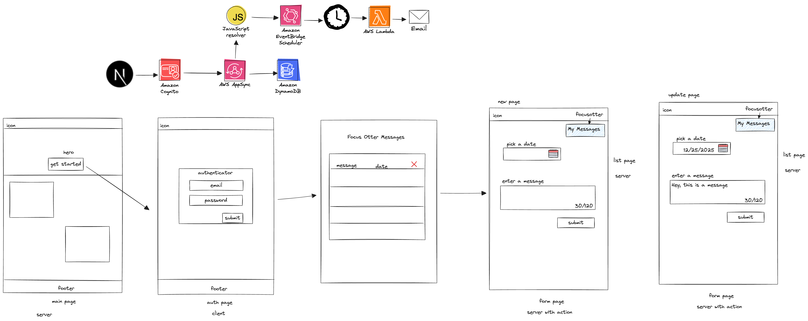
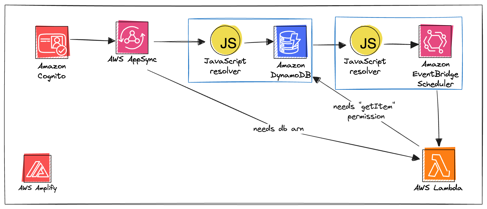

# Fullstack Message Scheduler


> I made a starter repo! https://github.com/mtliendo/fullstack-gen2-starter.git I'll flesh it out soon, but this is what I'm using to get started. Pretty excited about it!

## Project Overview



This app uses has almost everything!

- NextJS App Router with server actions
- Authentication with Amazon Cognito
- Data management powered by AWS AppSync and DynamoDB
- Custom data mutations written as JS Resolvers
- Amazon EventBridge Scheduler configured as an HTTP Datasource
- A Lambda function that sends an email

## Notes

I start by clonig the repo
Then I remove git and reinstall: `rm -rf .git && git init`
I then make a commit and push to my branch as `fullstack-message-scheduler`

From there, I change the text in the UI to match the project.

With that out of the way, I start the project. It fails. I have to install my deps and init amplify:

```sh
npm i && npx ampx sandbox --profile focus-otter-youtube
```

App deploys :)

I start the frontend : `npm run dev`. No errors.
I change all references to `/things` to `/messages`.

I test out the links--they work. I create a new user. Works also :)

Project is configured.

## Data Model

I think I'll call each type of data a `Message`. A message is the following:

```graphql
type Mutation {
	id: String!
	updatedAt: AWSDateTime!
	createtAt: AWSDateTime!
	message: String!
	deliveryDate: AWSDateTime!
	email: AWSEmail! ## Not sure if I need this, or if it can be pulled off of the ctx.identity object
	# From the looks of this doc, I won't be able to: https://docs.aws.amazon.com/appsync/latest/devguide/resolver-context-reference-js.html#aws-appsync-resolver-context-reference-identity-js
}
```

The first 3 items I don't have to create.

I'll create the next 3. From that, I derived the following:

```ts
const schema = a.schema({
	Message: a
		.model({
			message: a.string(),
			deliveryDate: a.datetime(),
			email: a.email(),
		})
		.authorization((allow) => [allow.owner()]),
})
```

Damn...well auth, API and the database are set.

### Listing Data

Quick sanity check. In the messages/page.tsx page, I'm going to try and list the Messages to make sure I get an empty array.

🗒️ In my starter, make sure I add this. Looks like I forgot to:

```ts
//amplifyServertils.ts
import { cookies } from 'next/headers'
import { type Schema } from '@/amplify/data/resource'
import { generateServerClientUsingCookies } from '@aws-amplify/adapter-nextjs/api'
import { getCurrentUser } from 'aws-amplify/auth/server'

// used for making API requests in my components
export const cookiesClient = generateServerClientUsingCookies<Schema>({
	config: outputs,
	cookies,
})

//Not necessarily needed, but good to have.
export async function AuthGetCurrentUserServer() {
	try {
		const currentUser = await runWithAmplifyServerContext({
			nextServerContext: { cookies },
			operation: (contextSpec) => getCurrentUser(contextSpec),
		})
		return currentUser
	} catch (error) {
		console.error(error)
	}
}
```

In my `/messages/page.tsx` file I add the following:

```ts
import { cookiesClient } from '@/utils/amplifyServertils'

//inside ListPage component
const { data: messages } = await cookiesClient.models.Message.list()
console.log('the messages', messages)
```

Sure enough I get "the messages []" printed out.

### Creating Data

I'm now in the /messages/new/page.tsx file.

> 🗒️ Todo for starter: REview what I did for the submit button ie SubmitButton component

```tsx
<input className="input input-accent" name="name" type="text" />
<button className="btn btn-secondary" type="submit">
  Submit
</button>
```

I verified that sending data to the action works. Time to actually create the item.

Oh wait..I need to pass the date and email.

The date should be ISO format. No--wait.

https://docs.aws.amazon.com/scheduler/latest/UserGuide/schedule-types.html

```sh
$ aws scheduler create-schedule --schedule-expression "at(2022-11-20T13:00:00)" --name schedule-name \
--target '{"RoleArn": "role-arn", "Arn": "QUEUE_ARN", "Input": "TEST_PAYLOAD" }' \
--schedule-expression-timezone "America/Los_Angeles"
--flexible-time-window '{ "Mode": "OFF"}'
--action-after-completion 'DELETE'  <--This is new! Pretty cool 😎
```

Looking at this, the timezone is the nicely formatted one. Nice!

```ts
const userTimeZone = Intl.DateTimeFormat().resolvedOptions().timeZone
```

That'll get the job done. I can add that as a hidden field.

When I pass the data + the hidden field to my server action, I get the following:

```ts
{
  message: 'hey there',
  date: '2024-05-09T20:23',
  timezone: 'America/Chicago'
}
```

I'll have to make sure I pass timezone to the data model.
To get the user's email I do:

```ts
const user = (await authGetCurrentUserServer()) as AuthUser
```

and just pass it to my server action:

```ts
<input type="hidden" name="email" value={user?.signInDetails?.loginId} />
```

Hmm...I did it. I created a message. But I don't seem to have any new messages. No items in my table. I'm catching the error. But not seeing anything.

lol...all these years and I forget that GraphQL errors with a 200 😅 I log out the response.

lookslike deliveryDate has an invalid value:

```ts
{
  message: 'Hey there',
  deliveryDate: '2024-05-09T18:58',
  email: 'mtliendo@focusotter.com',
  timezone: 'America/Chicago'
}
```

Looks like the `datetime` aka `AWSDateTime` field expect the format: YYYY-MM-DDThh:mm:ss.sssZ where the Z is the UTC (Zulu) time. I'm just gonna switch it to a string.

I get a data object back :)

```ts
data: {
    id: '9298d08c-df27-44e9-b338-f6619c5224d1',
    message: 'Alright lets do this!',
    deliveryDate: '2024-05-09T19:02',
    email: 'mtliendo@focusotter.com',
    timezone: 'America/Chicago',
    createdAt: '2024-05-10T00:02:40.948Z',
    updatedAt: '2024-05-10T00:02:40.948Z',
    owner: '34c8b428-c021-7069-bc5c-f4d8e57a98a9'
  },
```

With that done, I'm at a fork in the road. I can either do update and delete, or get this scheduler piece working.

I'm gonna go with the scheduler.

## Architectural Decisions

I can do one of 3 things here.

1. Put the message in DynamoDB. Get the response back. Then create a schedule based on that.

2. Put the message in DynamoDB. In the same resolver pipeline, create the schedule.

3. Put the message in DynamoDB. Then from a Lambda stream create the schedule.

### Option 1

This option makes a request to AWS. Then I get a response back. From that response, I make another request to AWS. This is easy to understand, and by having two separate operations, I have control on how each is configured. I will use a JS resolver to create the second operation. But nothing is stopping me from switching it out to a Lambda (except my free concious). In terms of documentation, it is likely easy to figure out how to do this method.

### Option 2

I rework what I have such that a custom mutation invokes a pipeline with two steps: First put the data into DynamoDB. Then create the schedule. Typically saving data to DynamoDB is the last step, so this is interesting to me. Additionally, creating a multi-step pipeline resolver in a Gen2 app hasn't been showcased yet. So that would help future people. I could even show how to do error handling and environment variables (not sure if that part is supported in gen2 🤔). This step would be extra work as it backtracks on what I already have setup. This step has the quickest data flow, but that is not pertinent to an app that schedules tasks in the future. This step is an example of how to keep most of what Amplify does for you, but modify one operation.

### Option 3

This option is the simplest to implement. I could probably finish the project much sooner since I would store the data in DynamoDB and from there let a Lambda function carry off the rest. Documentation is easily found (I myself have several tutorials on making streams). And while DynamoDB stream don't guarantee ordering, that's not an issue in my case. This step involves the most latency, but again not an issue.

If I were to rank these in order of "cool, let's get the job done" it'd be:

1. option 3
2. option 1
3. option 2

But I'm a DA. And I would best benefit the community by showing them how to do something that involves less moving parts and that would benefit them best along their journey.

Option 2 it is.

## Refactoring Creating Todos

So, I need to create 1 API operation that invokes 2 resolvers. One save an item to DynamoDB (by owner) and passes that data to a second resolver that will create the function.

For my own reference, an item is saved in DynamoDB as such:

```ts
{
 "id": "9298d08c-df27-44e9-b338-f6619c5224d1",
 "createdAt": "2024-05-10T00:02:40.948Z",
 "deliveryDate": "2024-05-09T19:02",
 "email": "mtliendo@focusotter.com",
 "message": "Alright lets do this!",
 "owner": "34c8b428-c021-7069-bc5c-f4d8e57a98a9::34c8b428-c021-7069-bc5c-f4d8e57a98a9",
 "timezone": "America/Chicago",
 "updatedAt": "2024-05-10T00:02:40.948Z",
 "__typename": "Message"
}
```

Though similar, note that the \_\_typename isn't returned as part of the API response to the client.

> Note that the owner field has the double sub. This is because [Amplify stores owner info](https://docs.amplify.aws/react/build-a-backend/data/customize-authz/per-user-per-owner-data-access/) as <sub>::<username>. Also auth is such that only auth users can call this endpoint.

So I think step 1 of this is to mirror `createMessage` with my own mutation.

I'll create a new operation called `CreatMessageSchedule` in `data/resource.ts`

As I'm doing this, on a second monitor, I have [the relevant docs](https://docs.amplify.aws/react/build-a-backend/data/custom-business-logic/) pulled up.

I save and deploy the following:

```ts
createMessageSchedule: a
  .mutation()
  .arguments({
    message: a.string().required(),
    deliveryDate: a.string().required(),
    email: a.email().required(),
    timezone: a.string().required(),
  })
  .returns(a.ref('Message'))
  .authorization((allow) => [allow.authenticated()]),
```

I get the following error:

```txt
Custom operation createMessageSchedule requires both an authorization rule and a handler reference
Caused By: Custom operation createMessageSchedule requires both an authorization rule and a handler reference
```

That makes sense. I never gave it my custom business logic.

Still using [the docs](https://docs.amplify.aws/react/build-a-backend/data/custom-business-logic/#step-2---configure-custom-business-logic-handler-code) as reference, I add the following to my code:

```ts
.handler(
  a.handler.custom({
    dataSource: a.ref('Message'),
    entry: './createMessage.js',
  }),
),
```

Hmm...I'm jumping ahead a little bit, but how would I chain on multiple handlers? I'm not seeing an option to do so in the docs or via intellisense. I reach out to the team.

While doing that, I see the note in the docs:

> "All handlers must be of the same type. For example, you can't mix and match a.handler.function with a.handler.custom within a single .handler() modifier."

This implies that you can, and it would be in a `.handler` function. Ah. I see, the docs show passing `a.handler.custom` directly, but it'll also accept an array. I'll PR the docs to get this updated.

Alright. Digressed enough. Back to it. I add my `createMessage` file and am curious if it'll clash with anything Amplify may have generated of the same name.

The docs show the `util` library being used in the JS resolver:

```js
util.dynamodb.toMapValues({ id: ctx.args.postId }),
```

Is this package brought in? I don't like this uncertainty of working with JS 😅 and it kinda goes against the TS-first approach of Amplify. So since `esbuild` is already imported as a dependency, I'm going to add a `build.mjs` command. I'll install the `glob` package as well and paste in the following:

```js
/* eslint-disable */
import { build } from 'esbuild'
import { glob } from 'glob'
const files = await glob('amplify/data/customOperations/**/*.ts')
console.log(files)

await build({
	sourcemap: 'inline',
	sourcesContent: false,
	format: 'esm',
	target: 'esnext',
	platform: 'node',
	external: ['@aws-appsync/utils'],
	outdir: 'amplify/data/customOperations.',
	entryPoints: files,
	bundle: true,
})
```

This works...I think, but amplify is watching for all files in the Amplify directory and then failing when it comes across the ts file since AppSync doesn't accept ts, only Js. I need to tell the sandbox to ignore that path...ah ha! https://docs.amplify.aws/react/reference/cli-commands/#npx-ampx-sandbox

I can pass it `--exclude`. I try this:

```sh
npx ampx sandbox --profile focus-otter-youtube --exclude amplify/data/customOperations/**/*.ts
```

Didn't work. I spent some messing with it and found the following to work

```sh
npx ampx sandbox --profile focus-otter-youtube --exclude data/customOperations/**/*.ts
```

Hmm...but then I'll need to generate my backend graphql types:

```sh
npx ampx generate graphql-client-code --format graphql-codegen --statement-target javascript --out <path_to_app>/src/graphql/ --profile focus-otter-youtube
```

It's nice that this is doable, but then I'll have to remember to run this command. I'm going to say this is currently not worth it.

Reverted back to the original way. created my resolver by referening [the docs on the `identity` object](https://docs.aws.amazon.com/appsync/latest/devguide/resolver-context-reference-js.html) and [the docs on ddb utils](https://docs.aws.amazon.com/appsync/latest/devguide/tutorial-dynamodb-resolvers-js.html).

It worked, but I wanted to log the `ctx.result` value in the context. This _still_ isn't included (I asked for this over a year ago as it's straightforward to do in the CDK).

In any case, this is the core logic in the request. Pretty straightforward.

```ts
export function request(ctx) {
	const { username, sub } = ctx.identity
	const id = util.autoId()

	const now = util.time.nowISO8601()
	const owner = `${sub}::${username}`
	const item = {
		...ctx.args,
		createdAt: now,
		updatedAt: now,
		owner,
		__typename: 'Message',
	}
	const key = { id: util.autoId() }
	return ddb.put({ key, item })
}
```

Gonna swap this out in my UI:

```diff
-const res = await cookiesClient.models.Message.create(rawFormData)
+const res = await cookiesClient.mutations.createMessageSchedule(rawFormData)
```

Granted, I tested this all out in the AppSync Console ahead of time, but this worked the first time in the UI :)

## Scheduling Events with EventBridge Scheduler

I can't imagine this being tough. It's an http datasource just like Bedrock and [the docs on creating a schedule](https://docs.aws.amazon.com/scheduler/latest/APIReference/API_CreateSchedule.html) are pretty standard.

I created the datasource. To get the signing service endpoint I use [this page](https://docs.aws.amazon.com/general/latest/gr/aws-service-information.html). I kinda guessed on the signing-service name🤷‍♂️

This is attempt number 1, logs and all!:

```js
export function request(ctx) {
	console.log('hi im the request')
	console.log('the previouss', ctx.prev)
	return {
		resourcePath: '/schedules/TestOtter', //!This needs to be dynamic
		method: 'POST',
		params: {
			headers: {
				'Content-Type': 'application/json',
			},
			body: {
				ActionAfterCompletion: 'DELETE',
				ScheduleExpression: `at(${ctx.prev.result.deliveryTime})`,
				ScheduleExpressionTimezone: ctx.prev.result.timezone,
				Target: {
					Arn: ctx.env.SCHEDULE_FUNCTION_ARN,
					RoleArn: ctx.env.SCHEDULE_FUNCTION_ROLE_ARN,
					Input: { messageId: ctx.prev.result.id },
				},
			},
		},
	}
}
export function response(ctx) {
	console.log('hi im the response', ctx.result)
	const parsedBody = JSON.parse(ctx.result.body)

	console.log('hi im the parsed body', parsedBody)
	return parsedBody
}
```

This all assumes I call the endpoint and have a function in place. I'm just going to create a super basic function and give it the ability to access my table. Speaking of, I'll also create a role for the scheduler to assume when it's invoked. In this case, I think it's just the ability to `invoke:function`.

--fast forward a day of troubleshooting--

So, I have a circular dep issue.



It's between data and the function. Essentially, the Lambda function that EB Schedueler calls needs the ability to get an item from the database:

```ts
//create a policy for the function to get data from the MessagesTable
// table ARN is accessed by going through the API (backend.data)
backend.sendSESEmailFunc.resources.lambda.addToRolePolicy(
	new PolicyStatement({
		actions: ['dynamodb:GetItem'],
		resources: [backend.data.resources.tables['Message'].tableArn],
	})
)
```

But my data API needs the ARN of the function:

```ts
backend.data.resources.cfnResources.cfnGraphqlApi.environmentVariables = {
	SCHEDULE_FUNCTION_ROLE_ARN: schedulerRole.roleArn,
	SCHEDULE_FUNCTION_ARN: backend.sendSESEmailFunc.resources.lambda.functionArn,
}
```

This is a problem. So I can't hardcode the function name since if I name my function "test" it's still going to be "amplify-test-randomId".

A app that has a function that accesses the backend db is a common pattern ie postConfirmation triggers. How would those be handled?

Ah--I found in the Amplify docs this:https://docs.amplify.aws/react/build-a-backend/functions/examples/create-user-profile-record/#pageMain

So essentially, you go through the API. Ok--I can do that.

I updated my API to allow the function, but I only want to allow it to access my 1 mutation.

So instead of this:

```ts
.authorization((allow) => [allow.resource(sendSESEmailFunc).to(['mutate'])])
```

I want this:

```ts
.authorization((allow) => [
		allow.resource(sendSESEmailFunc).to({ mutate: ['createMessageSchedule'] }),
	])
```

Ok--this is acceptable and I'll consider myself unblocked. I make a couple tweaks to my schema since apparently I need a `ClientToken`. The SDK will create this for me, but apparently the CLI command won't.

I'm not able to create my schedule. I try it again, it didn't work.

Oh, I need to give it a unique name. Reminder to update my schema to do that..but that should by dynamic since people can conflict with the names. I'll come back to this.

The docs, give this command to run, which I'll modify:

```sh
npx ampx generate graphql-client-code --out <path-to-post-confirmation-handler-dir>/graphql
```

to be this:

```sh
npx ampx generate graphql-client-code --out amplify/functions/sendEmail/graphql --profile focus-otter-youtube
```

So this is also how to call AppSync from a Lambda function 😮

I update my function and it works! Im pretty much just experimenting with things at this point. I added a way to pass a title from the frontend so that it's dynamic. Calling this project good. It took longer than expected, but learned a bunch a long the way!
